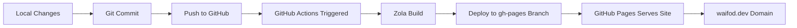

# Design Document: Website Migration to Zola with PaperMod

## Overview

This design outlines the recreation of a personal website using Zola static site generator with the PaperMod theme. The site will be deployed to GitHub Pages and served at the custom domain waifod.dev. The implementation involves setting up a new Zola project, migrating existing content from the current Zola site, configuring the PaperMod theme with search disabled, and establishing automated deployment via GitHub Actions.

## Architecture

### High-Level Structure

```
website_papermod/
├── config.toml              # Main Zola configuration
├── content/                 # Markdown content
│   ├── _index.md           # Home page
│   └── blog/               # Blog posts
│       ├── _index.md       # Blog listing page
│       └── *.md            # Individual posts
├── themes/                  # Theme directory
│   └── papermod/           # PaperMod theme (git submodule)
├── static/                  # Static assets (images, PDFs, etc.)
├── .github/
│   └── workflows/
│       └── deploy.yml      # GitHub Actions deployment workflow
├── .gitignore
└── README.md
```

### Deployment Flow



## Components and Interfaces

### 1. Zola Configuration (config.toml)

**Purpose**: Central configuration file for site metadata, theme settings, and build options.

**Key Settings**:
- `base_url`: Set to "https://waifod.dev"
- `title`: "waifod"
- `theme`: "papermod"
- `compile_sass`: true
- `minify_html`: true
- `generate_feeds`: true
- `[extra.papermod]`: Theme-specific configuration with search disabled

**Interface**:
```toml
base_url = "https://waifod.dev"
title = "waifod"
theme = "papermod"
compile_sass = true
minify_html = true
generate_feeds = true

[markdown]
highlight_code = true

[extra.papermod]
enable_search = false
# Additional PaperMod configuration
```

### 2. Content Structure

**Home Page** (`content/_index.md`):
- Author bio (Matteo Durante)
- Brief introduction
- Links to blog posts
- Social media and contact links (GitHub, LinkedIn, Email, CV)

**Blog Listing** (`content/blog/_index.md`):
- Configuration for blog post listing
- Sort by date (descending)
- Pagination settings

**Blog Posts** (`content/blog/*.md`):
- Front matter with title, date, tags
- Markdown content body
- Support for code blocks, quotes, headings

**Front Matter Format**:
```toml
+++
title = "Post Title"
date = 2024-10-15
[taxonomies]
tags = ["lain"]
+++
```

### 3. Theme Integration

**PaperMod Theme**:
- Source: https://github.com/cydave/zola-theme-papermod
- Installation method: Git submodule
- Location: `themes/papermod/`
- Configuration: Via `[extra.papermod]` section in config.toml

**Theme Customization**:
- Disable search functionality
- Configure navigation menu
- Set up social links
- Enable syntax highlighting

### 4. GitHub Actions Workflow

**Workflow File**: `.github/workflows/deploy.yml`

**Trigger**: Push to main branch

**Steps**:
1. Checkout repository code
2. Install Zola (latest version)
3. Build site using `zola build`
4. Deploy to gh-pages branch
5. GitHub Pages automatically serves from gh-pages

**Action Used**: `shalzz/zola-deploy-action@v0.18.0` or similar

**Workflow Structure**:
```yaml
name: Deploy to GitHub Pages

on:
  push:
    branches: [main]

jobs:
  build-and-deploy:
    runs-on: ubuntu-latest
    steps:
      - uses: actions/checkout@v4
      - name: Build and Deploy
        uses: shalzz/zola-deploy-action@v0.18.0
        env:
          GITHUB_TOKEN: ${{ secrets.GITHUB_TOKEN }}
```

### 5. Git Repository Configuration

**Repository Structure**:
- Main branch: Source code and content
- gh-pages branch: Built static site (auto-generated)

**Git Submodule**:
- PaperMod theme added as submodule
- Allows theme updates without copying files

**.gitignore**:
```
public/
.DS_Store
```

### 6. GitHub Pages Configuration

**Settings**:
- Source: Deploy from gh-pages branch
- Custom domain: waifod.dev
- HTTPS: Enabled

**DNS Configuration** (external to this project):
- CNAME record pointing waifod.dev to GitHub Pages
- Configured at domain registrar

## Data Models

### Blog Post Model

```
BlogPost {
  title: String           # Post title
  date: Date             # Publication date (YYYY-MM-DD)
  tags: Array<String>    # Taxonomies/categories
  content: Markdown      # Post body content
}
```

### Site Configuration Model

```
SiteConfig {
  base_url: URL          # Site domain
  title: String          # Site title
  theme: String          # Theme name
  compile_sass: Boolean  # SASS compilation flag
  minify_html: Boolean   # HTML minification flag
  generate_feeds: Boolean # RSS/Atom feed generation
  markdown: {
    highlight_code: Boolean
  }
  extra: {
    papermod: {
      enable_search: Boolean
      # Additional theme options
    }
  }
}
```

## Correctness Properties

*A property is a characteristic or behavior that should hold true across all valid executions of a system—essentially, a formal statement about what the system should do. Properties serve as the bridge between human-readable specifications and machine-verifiable correctness guarantees.*

### Property 1: Content Preservation

*For any* blog post in the source Zola site, when migrated to the new site, the post SHALL preserve its title, date, tags, and markdown content exactly.

**Validates: Requirements 2.1, 2.3**

### Property 2: Front Matter Conversion

*For any* blog post with Zola front matter, when converted to the new format, the front matter SHALL maintain the same semantic meaning with proper TOML syntax.

**Validates: Requirements 2.2**

### Property 3: Build Success

*For any* valid Zola project with PaperMod theme, when `zola build` is executed, the build SHALL complete successfully and generate a `public/` directory with HTML files.

**Validates: Requirements 1.1, 1.2**

### Property 4: Search Disabled

*For any* page generated by the site, when inspected, the page SHALL NOT contain search functionality or search-related JavaScript.

**Validates: Requirements 1.3, 6.1**

### Property 5: Navigation Consistency

*For any* page on the site, when rendered, the page SHALL include navigation links to home and blog sections.

**Validates: Requirements 3.1, 3.2**

### Property 6: Post Ordering

*For any* blog listing page, when rendered, posts SHALL be ordered by date in descending order (newest first).

**Validates: Requirements 3.3**

### Property 7: Deployment Automation

*For any* push to the main branch, when the GitHub Actions workflow executes, the workflow SHALL build the site and deploy to gh-pages branch without manual intervention.

**Validates: Requirements 5.2**

### Property 8: Domain Configuration

*For any* request to waifod.dev, when the site is deployed, the request SHALL be served by GitHub Pages with the correct content.

**Validates: Requirements 5.4**

## Error Handling

### Build Errors

**Scenario**: Zola build fails due to invalid front matter or markdown syntax

**Handling**:
- GitHub Actions workflow will fail and report error
- Developer reviews error logs in Actions tab
- Fix syntax errors in content files
- Re-push to trigger new build

### Theme Installation Errors

**Scenario**: PaperMod theme submodule fails to initialize

**Handling**:
- Verify git submodule commands executed correctly
- Check theme repository accessibility
- Manually clone theme if submodule fails
- Update .gitmodules file if repository URL changed

### Deployment Errors

**Scenario**: GitHub Actions fails to deploy to gh-pages

**Handling**:
- Verify GITHUB_TOKEN permissions in repository settings
- Check workflow permissions (Read and Write access required)
- Review Actions logs for specific error messages
- Ensure gh-pages branch exists or can be created

### Domain Configuration Errors

**Scenario**: Custom domain waifod.dev not resolving correctly

**Handling**:
- Verify DNS CNAME record points to GitHub Pages
- Check GitHub Pages custom domain settings
- Wait for DNS propagation (up to 24-48 hours)
- Test with dig/nslookup commands

## Testing Strategy

### Unit Tests

Unit tests will verify specific examples and edge cases:

1. **Front Matter Parsing**: Test that blog post front matter is correctly formatted
2. **Content Migration**: Verify specific blog posts maintain their content
3. **Configuration Validation**: Test config.toml syntax and required fields
4. **Build Output**: Verify expected HTML files are generated

### Property-Based Tests

Property-based tests will verify universal properties across all inputs (minimum 100 iterations per test):

1. **Property 1 Test**: Generate random blog posts, migrate them, verify content preservation
2. **Property 2 Test**: Generate various front matter formats, verify conversion correctness
3. **Property 3 Test**: Test build process with various valid configurations
4. **Property 6 Test**: Generate random post dates, verify sorting order

### Integration Tests

1. **Full Build Test**: Execute complete build process and verify output
2. **Theme Integration Test**: Verify PaperMod theme loads and renders correctly
3. **Navigation Test**: Verify all navigation links work correctly
4. **Deployment Simulation**: Test GitHub Actions workflow locally with act

### Manual Testing

1. **Visual Inspection**: Review rendered site in browser
2. **Search Verification**: Confirm search functionality is disabled
3. **Domain Testing**: Verify site accessible at waifod.dev
4. **Mobile Responsiveness**: Test site on various screen sizes
5. **Link Validation**: Click through all internal and external links

### Testing Tools

- **Zola CLI**: For local builds and testing
- **act**: For local GitHub Actions testing
- **Browser DevTools**: For visual and functional testing
- **curl/wget**: For HTTP response testing
- **HTML validators**: For markup validation
